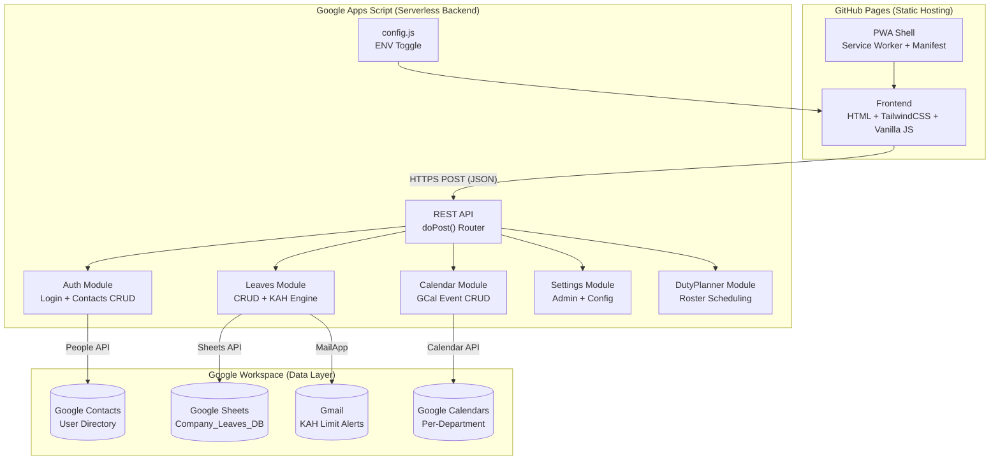
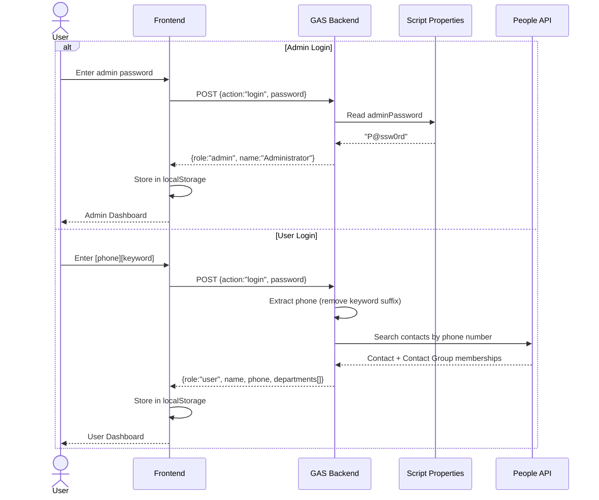

# Architecture

## Overview

## Components

| Layer | Technology | Role |
|---|---|---|
| **Frontend** | HTML5, TailwindCSS (CDN), Vanilla JS, Fuse.js, SortableJS, Lucide | Static SPA hosted on GitHub Pages across 3 environments |
| **Backend** | Google Apps Script (GAS) V8 Runtime | Serverless REST API processing GET/POST requests |
| **Backend Modules** | Code.js, Auth.js, Calendar.js, Leaves.js, Settings.js, DutyPlanner.js, config.js | Router, Auth, GCal CRUD, Leave CRUD + KAH, Admin Settings, Roster Scheduling, ENV Toggle |
| **Database** | Google Sheets (`Company_Leaves_DB`), Google Contacts, Google Calendar | Leave/event records + Duty Planner data, user directory & structure, event visualization |
| **Environments** | Exp, Dev, Prod (3 separate GitHub repos + GAS accounts) | Fully isolated staging pipelines |
| **CI/CD** | GitHub Actions + Google Clasp (Headless), GitHub Codespaces | Auto-deploys backend changes on push, credential generation |
| **PWA** | Service Worker (`sw.js`), Web App Manifest (`manifest.json`) | Offline support, cache-first strategy, installable app |

## Authentication Flow

### Login Modes

- **Admin**: Default password `P@ssw0rd` (change immediately after setup). Grants full access to settings, user management, and all data.
- **User**: Password is `[phone][keyword]` (e.g., `91234567peace`). The backend strips the keyword suffix, looks up the 8-digit phone in Google Contacts via People API, and returns the user's name and department(s).
- **Admin on Behalf**: Admin can search for any user via Fuse.js fuzzy search and submit leave/events on their behalf using the target user's identity.

### User Registration

New users register through the app: name, mobile, unit, birthday. The backend creates a Google Contact, adds it to the appropriate Contact Group, and invalidates the contacts cache. Once Google syncs (~1 minute), the user can log in with `[phone][keyword]`.

## Environment Isolation

To completely isolate Development, Experimental, and Production environments, host their GAS backends on **entirely separate Google Accounts** to prevent data cross-contamination in Drive and Contacts.

### Migration Steps

1. Log into your **New Google Account** and create a new project at [script.google.com](https://script.google.com/).
2. Add the **People API** service to the script project.
3. Manually copy-paste the contents of `backend/Code.js` from the repository into the GAS editor and run the `INITIAL_SETUP()` function. Authorize the script.
4. Do an initial manual deployment: Click **Deploy -> New Deployment**, select **Web App**, execute as **Me**, with access to **Anyone**.
5. Copy the new **Script ID**, **Deployment ID**, and **Web App URL**.
6. Generate new `CLASP_CREDS` using GitHub Codespaces. Ensure you run `clasp login --no-localhost` and log in with the **New** Google Account.
7. Update your GitHub Repository secrets (`SCRIPT_ID`, `DEPLOYMENT_ID`, `CLASP_CREDS`).
8. Update `backend/config.js` with the new Web App URL to route frontend traffic to the new isolated database.

## Frontend Module Structure

| File | Responsibility |
|---|---|
| `js/app.js` | App entry point, router, page initialization, auth guard |
| `js/state.js` | Central state management, localStorage persistence |
| `js/api.js` | GAS API communication, sync queue, background poller |
| `js/ui/ui.js` | Shared UI rendering: nav, dashboard, calendar, agenda |
| `js/ui/forms.js` | Leave/event submission forms, edit/cancel flows |
| `js/ui/calendar.js` | Calendar views (month grid, mini calendar) |
| `js/ui/parade.js` | Parade State rendering and interaction |
| `js/ui/admin/admin.js` | Admin settings panel (all tabs) |
| `js/ui/admin/structure.js` | Org structure tree view and drag-drop |
| `js/ui/dutyplanner/dp-app.js` | Duty Planner entry point |
| `js/ui/dutyplanner/dp-ui.js` | Duty Planner UI rendering |
| `js/ui/dutyplanner/dp-state.js` | Duty Planner state management |

## Backend Module Structure

| File | Responsibility |
|---|---|
| `backend/Code.js` | Main router (`doPost`/`doGet`), database init, schema verification |
| `backend/Auth.js` | Login flow, contacts CRUD, People API integration |
| `backend/Calendar.js` | Google Calendar event CRUD, calendar management |
| `backend/Leaves.js` | Leave/event CRUD, KAH limit engine, email alerts |
| `backend/Settings.js` | Admin settings read/write, event types, templates, KAH config |
| `backend/DutyPlanner.js` | Duty planner CRUD, schedule generation, database setup |
| `backend/config.js` | ENV toggle (`Exp`/`Dev`/`Prod`), API endpoint URLs |

## Data Flow

1. **Frontend** sends HTTPS POST requests with JSON payloads to the GAS Web App URL.
2. **GAS `doPost()`** router parses the `action` field and dispatches to the appropriate handler module.
3. Each handler reads/writes Google Sheets, Contacts, Calendars, or sends Gmail via the respective Workspace APIs.
4. Responses return as JSON to the frontend, which updates local state and re-renders the UI.

## Google Workspace Services Used

| Service | API | Purpose |
|---|---|---|
| Google Sheets | Sheets API | Leave/event records, duty planner data, configuration |
| Google Calendar | Calendar API | Per-department event calendars, meeting room calendar |
| Google Contacts | People API | User directory (read/write), contact group management |
| Gmail | MailApp | KAH limit alert emails |
| Google Drive | Drive API | Code backup to Google Docs |
