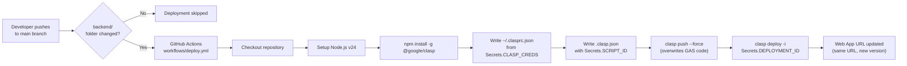

# Setup Guide

Complete deployment guide for Cloudy: Backend (Google Apps Script), Frontend (GitHub Pages), CI/CD (GitHub Actions), and initial app configuration.

---

## Step 1: Backend Setup (Google Apps Script)

1. **Create the Script Project:**
   * Go to [script.google.com](https://script.google.com/) and create a **New Project**.
   * Name it `Cloud Moves Backend`.

2. **Enable Google Workspace Services:**
   * On the left sidebar, click on **Services** (the `+` icon).
   * Find and add the **People API**.

3. **Import Backend Code:**
   * Create files matching the exact names in the `backend/` folder of the repository (`Code.js`, `Auth.js`, `Calendar.js`, `Leaves.js`, `Settings.js`, `DutyPlanner.js`, `config.js`). Copy and paste the respective contents into each file. *Note: Google Apps Script's V8 runtime supports `.js` files natively.*
   * Open the project settings (gear icon) and check **"Show 'appsscript.json' manifest file in editor"**. Overwrite the `appsscript.json` with the one from the repo.

4. **Initialize the Database:**
   * Open `Code.js`.
   * Select the `INITIAL_SETUP` function from the dropdown in the top toolbar and click **Run**.
   * Google will prompt you to authorize the script. Click **Review Permissions**, choose your Google Account, click **Advanced**, and proceed to the script.
   * *This function will automatically create a new Google Sheet named `Company_Leaves_DB` in your Google Drive and set up all default configuration properties.*
   * If you intend to use the **Duty Planner** feature, also select the `dpSetupDatabase` function and click **Run** to initialize the duty planner schema and default seniority levels.

5. **Deploy the Web App:**
   * Click the **Deploy** button (top right) -> **New deployment**.
   * Click the gear icon next to "Select type" and choose **Web app**.
   * **Description**: `Initial Deployment`
   * **Execute as**: `Me` *(Crucial: This ensures the app uses your account's Drive/Contacts)*.
   * **Who has access**: `Anyone` *(Crucial: Allows the frontend to communicate with it anonymously; the app handles its own auth)*.
   * Click **Deploy**.
   * **Copy the Web App URL** and the **Deployment ID**. Save these for later.

---

## Step 2: Frontend Setup

1. **Configure the API Endpoint:**
   * Open `backend/config.js` in your code editor.
   * Replace the `PROD_URL`, `DEV_URL`, and `EXP_URL` with the **Web App URLs** corresponding to their respective deployments.
   * Set `const ENV = 'Prod';` (or `'Dev'` / `'Exp'`) appropriately for the environment you are configuring.

2. **Deploy the Frontend:**
   * Push your code to your GitHub repository.
   * Go to your repository settings -> **Pages**.
   * Set the source to deploy from the `main` branch (root directory).
   * Your app will now be accessible at `https://[your-username].github.io/[repo-name]/`.

---

## Step 3: CI/CD Pipeline (Automated Backend Deployment)

To allow GitHub to push updates directly to Google Apps Script automatically, generate `clasp` (Google's CLI tool) credentials via GitHub Codespaces.

### Setup Instructions

1. **Generate Clasp Credentials via GitHub Codespaces:**
   * On your GitHub repository page, click the green **<> Code** button, switch to the **Codespaces** tab, and click **Create codespace on main**.
   * In the terminal, run: `npm install -g @google/clasp`
   * Next, run: `clasp login --no-localhost`
   * The terminal will provide a long Google URL. Open it in a new tab.
   * Log in with the Google Account hosting your Apps Script backend and click **Allow**.
   * Copy the resulting URL, paste it back into your Codespace terminal, and hit **Enter**.
   * Run: `cat ~/.clasprc.json`
   * Copy the *entire* JSON output. You can now close and delete the Codespace.

2. **Retrieve Project IDs:**
   * **Script ID**: Found in your GAS Project Settings (gear icon) under "IDs".
   * **Deployment ID**: Found via GAS Deploy -> Manage deployments.

3. **Configure GitHub Secrets:**
   * Go to your GitHub Repository -> **Settings** -> **Secrets and variables** -> **Actions**.
   * Add the following Repository Secrets:
     * `CLASP_CREDS`: Paste the JSON copied from Step 1.
     * `SCRIPT_ID`: Paste your Script ID.
     * `DEPLOYMENT_ID`: Paste your Deployment ID.

4. **How it works:**
   Every time you push a change to the `backend/` folder on the `main` branch, GitHub Actions will trigger `.github/workflows/deploy.yml`, pushing the code and updating the exact same Web App URL.

---

## Step 4: Initial App Configuration

1. **First Login:**
   * Open your frontend URL.
   * The default administrator password is `P@ssw0rd`.
   * Log in to access the App.

2. **Change Admin Password:** Go to **Menu -> Admin Settings -> General Settings** and change it immediately.

3. **Configure the App:** The admin panel has the following tabs:

   | Tab | Purpose | Docs |
   |---|---|---|
   | General Settings | Admin password, login keyword, app mode, landing page, menu/dashboard order | [Settings](admin-guide/settings.md) |
   | Users Management | Register, edit, remove users; contact name format; G-Contact sync | [Settings](admin-guide/settings.md) |
   | KAH Management | KAH limit, approving email, custom groups, email templates | [KAH Management](admin-guide/kah-management.md) |
   | Org Structure | Unit hierarchy, drag-drop personnel, tree/list views | [Settings](admin-guide/settings.md) |
   | Event Types & Templates | Event types, global/per-type templates, form field config | [Settings](admin-guide/settings.md) |
   | Acronyms / Shortforms | Short-form to long-form mappings for GCal titles | [Settings](admin-guide/settings.md) |
   | GCal Access Rights | Calendar sharing permissions | [GCal Access Rights](admin-guide/gcal-access.md) |
   | Fail-Safe Updater | Manual code patching when CI/CD fails | [Fail-Safe Updater](admin-guide/fail-safe.md) |

4. **Set Key Configuration Items:**
   * **User Login Keyword**: Set the keyword users append to their phone number (e.g., `peace`).
   * **Contact Name Format**: Control how names display using `{Name}` and `{Unit}` tags.
   * **Organisational Structure**: Build your unit hierarchy.
   * **Register Users**: Register your first batch of users. Google Contacts syncing takes ~1 minute.
   * **Event Types**: Configure the event types your organization uses.
   * **KAH Groups**: Set up Key Appointment Holder groups for out-of-office tracking.

5. **Ongoing Configuration:**
   * See the [Admin Guide](admin-guide/settings.md) for detailed walkthrough of each admin panel.
