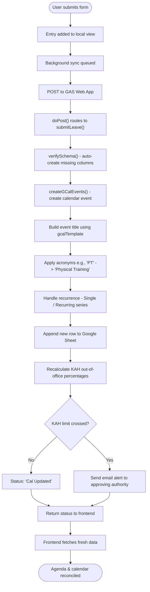

# My Calendar

My Calendar is the personal view for submitting, editing, and tracking your leaves and events. It shows only your own entries (unless you're an admin viewing on behalf of another user).

## Submitting a Leave or Event

### Access the Form
Navigate to **My Calendar** from the sidebar. The form appears at the top of the page.

If the app is in **Unified Mode**, a single combined form handles both leaves and events. In **Separated Mode**, separate menu items exist for Leave and Event forms.

### Form Fields

Fields shown depend on the selected event type and its admin configuration:

| Field | When Shown | Description |
|---|---|---|
| **Event Type** | Always | Dropdown of types configured by admin (e.g., Generic, Official Trip, Overseas Leave, Local Leave). |
| **Date / Range** | Always | Date picker for single or range selection. |
| **AM / PM** | Leave types | Toggle for half-day leave (AM only, PM only, or full day). |
| **Time (Start/End)** | Event types | Time pickers for time-bound events. |
| **Location** | Per-type config | "In Camp" or "Out of Camp" dropdown. When "In Camp" is selected, a **"Book Cloud Meeting Room"** checkbox may appear. |
| **Location Details** | Per-type config | Free-text field for specific location info (e.g., room number, venue name). |
| **Country / State** | Overseas types | Country and state/province for overseas travel. |
| **Attendees** | Per-type config | Fuzzy search via Fuse.js over the company directory. Select multiple attendees. |
| **Remarks** | Per-type config | Free-text notes. |
| **Repeat** | Event types | Recurrence options: no repeat, daily, weekly, monthly, yearly. |
| **InfoAll** | Event types | Toggle to mark this as a company-wide announcement (appears on all dashboards). |

### Field Ordering
The admin can reorder form field blocks per event type. The form will show fields in the configured order for the selected event type.

### Submission Process

1. Select the **Event Type** from the dropdown.
2. Fill in all visible fields.
3. Click **Submit**. The entry appears immediately in your calendar (optimistic update) and syncs to the server in the background.
4. If offline, the submission queues locally and syncs when connectivity returns.

## Editing an Entry

1. Click on your entry in the agenda or calendar view to expand it.
2. Click the **Edit** button (pencil icon).
3. The form reloads with the existing data. Modify fields as needed.
4. Click **Update**. The old GCal event is deleted, a new one is created, and KAH is recalculated.

## Cancelling an Entry

1. Click on your entry to expand it.
2. Click the **Cancel** button (X icon).
3. Confirm the cancellation.
4. The entry's status changes to `Cancelled`, all associated Google Calendar events are deleted, and KAH limits are recalculated.

## Two-Way Sync (GCal Reconciliation)

If someone manually deletes a Google Calendar event associated with one of your entries:
- The next time the app fetches data, it detects the missing GCal event.
- The entry is automatically cancelled and marked accordingly.

Singapore public holidays are also fetched from Google ICS calendars (cached for 6 hours) and merged into your leave feed.

## Admin on Behalf

Admins can submit leave/events on behalf of any user:
1. From the form, an admin sees a **"Submit on behalf of"** search field.
2. Search for the target user by name via Fuse.js fuzzy search.
3. The form submits using the selected user's identity and department.
